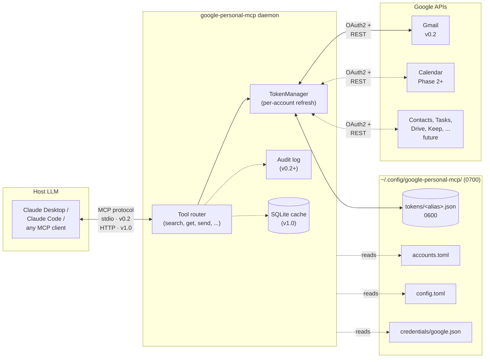

# google-personal-mcp

> **Status: v0.2 released.** Gmail tools, multi-account OAuth, `dry_run` safety net, JSONL audit log, and the three-layer test harness are all shipped. See [CONTRIBUTING.md](CONTRIBUTING.md) to set up a local dev environment.

A [Model Context Protocol](https://modelcontextprotocol.io) server written in Rust that exposes personal Google services (Gmail first; Calendar, Contacts, Tasks, etc. to follow) to AI assistants. Designed as a single, always-on daemon: low memory footprint, multi-account from day one, suitable for a personal VPS or local machine.

This MCP is a **data source** consumed by other knowledge tools. It is not a knowledge layer itself — no summarization, no classification, no "smart" composition. Tools are low-level primitives that mirror Google's APIs.

See [SPEC.md](SPEC.md) for concrete use cases and the search-excellence checklist.

## Architecture at a glance



Solid lines are shipped today (v0.2). Dotted lines are v0.3 work (full audit surface per [ADR-0011](docs/adr/0011-audit-log.md)), v1.0 work (SQLite cache, HTTP transport), or Phase 2+ services (Calendar / Contacts / Tasks / Drive). The daemon is one process per operator. Tokens live in `0600` files on disk; the daemon refuses to start if permissions are wider ([ADR-0017](docs/adr/0017-secrets-at-rest.md)).

## Why Rust

The daemon is designed to run forever. Rust's lack of a GC means memory stays flat over days and weeks — no GC pauses, no heap drift, no periodic restarts. The resulting binary is small, self-contained, and deploys without a runtime.

## Status and roadmap

| Phase | What it covers | State |
| --- | --- | --- |
| **Design** | 19 ADRs in [`docs/adr/`](docs/adr/). Architecture, tool surface, auth, error model, security, testing strategy. | ✅ Complete |
| **v0.2** | Gmail tools (`list_accounts`, `list_labels`, `search_threads`, `get_thread`, `archive_thread`, `batch_archive`, `trash_thread`, `batch_trash`, `modify_thread_labels`, `batch_modify_thread_labels`, `send_email`), multi-account OAuth with hot-reload, `dry_run` + send-dedup, per-account rate limiter, minimal JSONL audit log, macOS Keychain backend, read-only operator profile, Layer 1–4 tests. | ✅ Released |
| **v0.3** | Full audit surface ([ADR-0011](docs/adr/0011-audit-log.md)) — per-tool redaction rules, `audit_summary`, fsync-before-destructive, configurable rotation. Deferred tools: `mcp_status`, `list_attachments`, `download_attachment`. Observability v0.x subset: structured tracing spans, `/healthz`, systemd unit + INSTALL.md. | 🔜 In planning |
| **v1.0** | First public release. Streamable HTTP transport with session lifecycle ([ADR-0003](docs/adr/0003-transport-stdio-and-streamable-http.md)). Observability v1.0: Prometheus exporter + alertmanager rules + nginx template ([ADR-0008](docs/adr/0008-observability-and-deployment.md)). SQLite caching with Gmail History API invalidation ([ADR-0009](docs/adr/0009-caching-with-sqlite-and-history-api.md)). Cross-account fan-out for read tools ([ADR-0013](docs/adr/0013-cross-account-fan-out.md)). Tool versioning policy enforcement ([ADR-0015](docs/adr/0015-tool-versioning-policy.md)). | 🔮 Future |

The cut between v0.x and v1.0 is deliberate: features only earn their keep when there's a second user or an external operator. v1-scope notes in each affected ADR record what is deferred.

## Architecture

The design lives in 19 ADRs. The load-bearing ones:

- [ADR-0001](docs/adr/0001-monolithic-google-personal-mcp-architecture.md) — monolithic single-binary architecture, Google personal-data scope only
- [ADR-0002](docs/adr/0002-multi-account-architecture.md) — multi-account registry, `account` parameter on every tool
- [ADR-0004](docs/adr/0004-oauth-token-refresh.md) — proactive expiry refresh + 401 fallback, per-account
- [ADR-0007](docs/adr/0007-testing-strategy.md) — three-layer testing (units, wiremock, ignored e2e)
- [ADR-0012](docs/adr/0012-idempotency-and-dry-run.md) — `dry_run` and send-deduplication on destructive tools
- [ADR-0016](docs/adr/0016-tool-surface-and-conventions.md) — locked v1 tool inventory + parameter conventions
- [ADR-0017](docs/adr/0017-secrets-at-rest.md) — token-file permissions, redacted Debug, deployment guidance
- [ADR-0018](docs/adr/0018-email-content-trust.md) — untrusted-content wrapping; prompt-injection defense

See [ADR-0000](docs/adr/0000-adr-process.md) for the full corpus, the ADR process, and the open-questions queue.

## Quick start

```sh
# 1. Build
cargo build --release

# 2. Create GCP credentials and config (see CONTRIBUTING.md)

# 3. Add a Google account
google-personal-mcp auth add --alias personal

# 4. Wire into your MCP client (Claude Desktop, Claude Code, etc.)
#    Command: /path/to/google-personal-mcp serve
#    Transport: stdio
```

See [CONTRIBUTING.md](CONTRIBUTING.md) for the full setup walkthrough.

## Contributing

See [CONTRIBUTING.md](CONTRIBUTING.md) for local dev setup, the three test layers, and the GCP project / OAuth client configuration each contributor needs.

## Security

See [SECURITY.md](SECURITY.md). The daemon holds long-lived OAuth refresh tokens for personal Google accounts; the threat model is in [ADR-0017](docs/adr/0017-secrets-at-rest.md) and [ADR-0018](docs/adr/0018-email-content-trust.md). Report vulnerabilities via [GitHub Security Advisories](https://github.com/torsday/google-personal-mcp/security/advisories/new).

## License

MIT. See [LICENSE](LICENSE).
