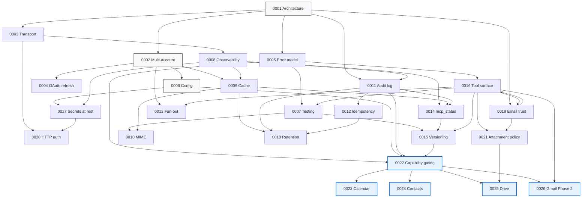

# ADR corpus — index and dependency graph

This index is a browse-aid for [`docs/adr/`](.). [ADR-0000](0000-adr-process.md) defines the ADR process; this file groups the 26-ADR corpus by topic, shows the load-bearing dependency graph, and recommends a reading order for new contributors.

The corpus table in ADR-0000 is the authoritative list with current statuses; this index is the navigational layer.

---

## By topic

### Foundation (project shape; everything builds on these)

| # | Title | Status |
|---|---|---|
| [0000](0000-adr-process.md) | ADR process and corpus | Accepted |
| [0001](0001-monolithic-google-personal-mcp-architecture.md) | Monolithic Google-services MCP daemon | Accepted |
| [0002](0002-multi-account-architecture.md) | Multi-account registry, hot-reload | Accepted |
| [0006](0006-config.md) | Config schema (TOML) | Accepted |

### Transport, auth, errors (how things talk and fail)

| # | Title | Status |
|---|---|---|
| [0003](0003-transport-stdio-and-streamable-http.md) | Dual transport (stdio + Streamable HTTP) | Accepted |
| [0004](0004-oauth-token-refresh.md) | OAuth token refresh — proactive + lazy 401 fallback | Accepted |
| [0005](0005-error-model.md) | Typed error model | Accepted |
| [0020](0020-http-transport-authentication.md) | HTTP-transport authentication — bearer tokens + optional mTLS | Accepted (shipped in v1.0) |

### Quality, testing, observability, versioning (the discipline layer)

| # | Title | Status |
|---|---|---|
| [0007](0007-testing-strategy.md) | Testing strategy — units, wiremock, ignored e2e, snapshot | Accepted |
| [0008](0008-observability-and-deployment.md) | Observability and deployment | Accepted (shipped in v1.0) |
| [0015](0015-tool-versioning-policy.md) | Tool versioning policy — additive-only, snapshot-enforced | Accepted (shipped in v1.0) |

### Persistence (data the daemon owns)

| # | Title | Status |
|---|---|---|
| [0009](0009-caching-with-sqlite-and-history-api.md) | Caching with SQLite + Gmail History API | Accepted |
| [0010](0010-mime-and-encoding.md) | MIME and encoding | Accepted |
| [0011](0011-audit-log.md) | Append-only audit log | Accepted |
| [0019](0019-data-retention-and-purge.md) | Data retention and purge | Accepted (shipped in v1.0) |

### Safety primitives (what protects operator data)

| # | Title | Status |
|---|---|---|
| [0012](0012-idempotency-and-dry-run.md) | Idempotency and dry-run | Accepted |
| [0017](0017-secrets-at-rest.md) | Secrets at rest | Accepted |
| [0018](0018-email-content-trust.md) | Email content trust / prompt-injection mitigation | Accepted |
| [0021](0021-attachment-download-policy.md) | Attachment download policy | Accepted (shipped in v0.3) |

### Tool surface — Gmail v1.0 baseline + cross-cutting

| # | Title | Status |
|---|---|---|
| [0013](0013-cross-account-fan-out.md) | Cross-account fan-out (`account: "*"`) | Accepted (shipped in v1.0) |
| [0014](0014-status-introspection-tool.md) | `mcp_status` introspection tool | Accepted (shipped in v1.0) |
| [0016](0016-tool-surface-and-conventions.md) | Tool surface and parameter conventions (Gmail v1.0) | Accepted |

### v1.1 design program (capability gating + the three new services + Gmail Phase 2)

| # | Title | Status |
|---|---|---|
| [0022](0022-capability-gating.md) | Capability gating — service × aspect toggles | Accepted, target v1.1 |
| [0023](0023-calendar-service-surface.md) | Calendar service surface | Accepted, target v1.1 |
| [0024](0024-contacts-service-surface.md) | Contacts (People API) service surface | Accepted, target v1.1 |
| [0025](0025-drive-service-surface.md) | Drive service surface | Accepted, target v1.1 |
| [0026](0026-gmail-tool-surface-phase-2.md) | Gmail tool surface — Phase 2 expansion | Accepted, target v1.1 |

---

## Dependency graph

Load-bearing dependencies only — every edge means "you cannot implement A without B's decision already in place." Cross-references that are merely informative are omitted.

The blue-highlighted box is the v1.1 design program; everything beneath ADR-0022 in that subgraph waits on it.

---

## Reading order

### For a new contributor (one sitting, ~90 minutes)

1. **[0000](0000-adr-process.md)** — how ADRs work in this repo.
2. **[0001](0001-monolithic-google-personal-mcp-architecture.md)** — what the project is and isn't.
3. **[0016](0016-tool-surface-and-conventions.md)** — the v1.0 tool inventory; sets the vocabulary every later ADR uses (`account: String`, `_untrusted` suffix, `batch_` prefix, `dry_run`, etc.).
4. **[0018](0018-email-content-trust.md)** — the trust model that runs through every read response.
5. **[0022](0022-capability-gating.md)** — the v1.1 capability model layered on the OAuth scope ceiling.

That's the core. Everything else is reachable from these five.

### For a contributor implementing a v1.1 service

1. **[0022](0022-capability-gating.md)** — the aspect vocabulary and per-account / per-tool config shape.
2. The relevant service ADR: **[0023 Calendar](0023-calendar-service-surface.md)** / **[0024 Contacts](0024-contacts-service-surface.md)** / **[0025 Drive](0025-drive-service-surface.md)**.
3. **[0016](0016-tool-surface-and-conventions.md)** — naming + parameter conventions every tool follows.
4. **[0018](0018-email-content-trust.md)** — the untrusted-content wrapping discipline.
5. **[0012](0012-idempotency-and-dry-run.md)** — destructive-op safety stack.
6. **[0009](0009-caching-with-sqlite-and-history-api.md)** — caching pattern (each service ADR defers its own caching to a follow-up, but the shape comes from here).

### For a contributor extending Gmail (v1.1 Phase 2)

1. **[0016](0016-tool-surface-and-conventions.md)** — the v1.0 baseline.
2. **[0026](0026-gmail-tool-surface-phase-2.md)** — the 24-tool Phase 2 expansion.
3. **[0022](0022-capability-gating.md)** — the `send_draft` per-tool override sanctioned exception.

---

## Out-of-scope discipline

Each accepted ADR ends with what it deliberately *doesn't* build. Scope creep gets caught at the ADR layer, not in PR review. New work that doesn't fit any existing ADR's scope should either start a new ADR (per [0000](0000-adr-process.md)) or live in the [0000](0000-adr-process.md) Open Questions queue until a milestone forces a decision.

The current Open Questions queue lives at the bottom of [ADR-0000](0000-adr-process.md#open-questions-decisions-queued-for-later). Additional "future ADR" stubs that ADRs explicitly flag (account hot-reload, audit hash-chaining, idempotency keys, etc.) are tracked as `type: spike` / `needs-design` tickets in the v1.1 milestone.
